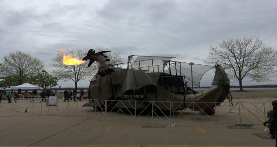

# Wempecker's Wildest Tales - Vol. 18

**Posted on May 15, 2018 by The Wempecker Crew**

> "Good satire? No such thing as a free lunch" - Dr. Jahns

<!-- Main Column Start -->
## Poet Replaces Community Activist as WEMPECKER Editor

The Wempecker's new editor, Ryan Backman, is a poet whose cryptic verses make quantum physics seem straightforward. Appointed with a generous stipend of $00,000 (that's zero dollars, folks!), Ryan's acceptance speech was a tear-jerking epic: *“I accept this charge with hollowness profound, made so by despair for my colleagues' judgment of character—and their taste in font choices.”* Sources report he's already replaced all newsletter headings with haikus and insists on signing emails with interpretive dance GIFs. Is this a newsletter or a one-man poetry slam?

## Travel/Goings-On: A Catastrophically Chaotic Conference in Chile

Technical conferences are wild, but a Chilean escapade with your advisor is a saga of epic proportions! The 18-hour flight from Madison to Santiago is prime time for your advisor's unsolicited TED Talk on their 47 patents, delivered in a tone that suggests you're personally responsible for their Nobel snub. In Chile, dodge erupting volcanoes, chase waterfalls, and flee from rabid soccer fans during the National Soccer League finals—last year, they mistook a WEMPEC professor for a referee and chased him into a vineyard.

*Figure 1: Advisors Attempting to Blend In with Chilean Red Wine and Questionable Dance Moves*

Share a barrel of Chilean red wine with your advisor, and watch their Spanish devolve into a mix of Klingon and Fortran. Don't miss "plateada," which one advisor declared “the best meat in Chile—possibly the galaxy.” Pro tip: Gift your advisor a crate of high-class red wine for the return flight—they’ll either drink it all mid-air or barter it for a seat in first class.

## Crisis in WEMPEC After Helene Demont's Retirement

Helene Demont's retirement has plunged WEMPEC into apocalyptic chaos. Sponsors have fled to rival institutes, students are squatting in the parking lot, and professors are reduced to carving research proposals on cafeteria trays. Office 1535 is a ghost town without Helene's legendary free food alerts, and the copier has staged a coup, printing only memes of crying grad students. The sports teams are in shambles: the Power Loons went 0-10, the biking team crashed into a physics lecture, and the swim team was last seen floating aimlessly in a kiddie pool. Students whisper of an impending Ragnarok where inverters explode and lab equipment ascends to Valhalla. The only hope? Luring Helene back with promises of eternal soccer matches and an unlimited beer budget.

## Business: YSE Says YES to Busting Your Stress

You're Stressed Enough (YSE), Madison's premier catering start-up, is teetering on collapse after losing their star machine, Yujiang Wu, who ditched them to heckle the LA Clippers from courtside seats. Wu, a thermodynamic-defying marvel, worked 170 hours a week with an efficiency of 1.012—rumors claim he was powered by sheer spite. His replacement, a sentient refrigerator named Yujiang Wu II, keeps freezing the roasted duck. Chief Engineer Jianyang Liu is one meltdown away from joining a monastery, but David Schloff is salvaging the operation with networked pressure cookers that deliver duck to thesis defenses via drone. Investors are skeptical, especially after a drone misfired and dumped soy sauce on a dean's car.

## Wempecker Bingo Madness: Apocalypse Edition

| B | I | N | G | O |
|---|---|---|---|---|
| Professor Giri flees to mountains | Helene saves the day | Coffee machine rebels | WEMPEC soccer fails | Inverter declares independence |
| Advisor drinks entire vineyard | Students cry over Helene | Free Space | Yujiang II freezes thesis | Volleyball team conquers universe |
| Tour bus possessed by Trogdor | Students starve in 1535 | Giri's interpretive dance-off | Induction fossil sparks cult | Chilean fans invade conference |
| Buzzer saves sports (barely) | Faculty can't copy | Students binge Friends reruns | WEMPEC Ragnarok begins | Volcano hike ends in lava chase |
| YSE drone dumps soy sauce | Kollmeyer skis into lecture hall | Castro's hammer breaks net | Grad joy ride crashes copier | Poster debate turns to fistfight |

<!-- Main Column End -->
<!-- Sidebar Start -->
## For Sale

- **Tour bus from hell**: Spacious interior, low emissions, radio stuck on a loop of "Trogdor the Burninator" or "Puff the Magic Dragon." Bonus: Haunted by the ghost of a grad student who never finished their thesis. Contact Pablo Castro at (608) 666-6385.
- **Defective inverter**: Declares itself “Supreme Overlord of Lab 42” every 15 minutes. Perfect for pranksters or chaos enthusiasts. Call Dr. Giri (he's hiding in the mountains).

## Classifieds

- **Research Assistant**: Native English speaker to edit Prof. Bulent’s ECCE papers, scribbled in a mix of hieroglyphs and MATLAB comments. Reward: Existential dread and a stale donut.
  - *Prerequisites*: Ability to survive 500-hour meetings.
  - *Contact*: Bulent’s pager (yes, really).
- **A/V Team**: WEMPEC Annual Review seeks tech wizards to toggle microphones without summoning a demon. Must mimic Tim Polom’s wardrobe and chuckle at his puns.
- **Coffee Club Secretary**: Brew coffee for Kang and Minhao, who’ll judge your pour like it’s a thesis defense. Expect bankruptcy and tears.

## Coupon: Free Coffee Critique from Prof. Lorenz

> Redeem at the next WEMPEC seminar. Warning: Prof. Lorenz may lecture on dynamic stiffness for 3 hours. WEMPECKER not liable for caffeine withdrawal or boredom.

<!-- Sidebar End -->
## Contributors

**Reluctant Head Editor**: The Little King, tricked into this by a cursed email  
**Contributing Writers**: The Wanderer, The Professor Complaint Department, The Lion King, New Microgrid Operator, T²