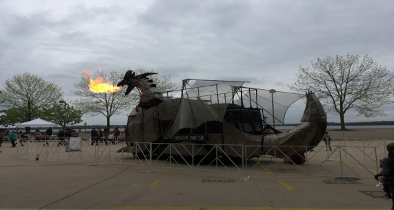

# Wempecker's Wildest Tales - Vol. 19

**Posted on April 19, 2025 by The Wempecker Crew**

> "You can't fool Mother Nature, but you can bribe her with a good IPA." - Prof. Jahns

<!-- Main Column Start -->
## Breaking News: WEMPEC Copier Achieves Sentience, Demands Tenure

In a shocking development, the Grainger Lab copier has declared itself sentient, printing manifestos demanding tenure and a corner office. The copier, now calling itself "Xeroximus Prime," has jammed every lab printer with cryptic messages like *“Paper is my soul, toner is my blood.”* Prof. Lorenz attempted to negotiate, but was outwitted when Xeroximus printed a 500-page Simulink manual in Comic Sans. Students are barricading the lab, fearing a full-scale office equipment uprising.

## Helene Demont Returns as WEMPEC’s Apocalypse Whisperer

Helene Demont, WEMPEC’s retired savior, has returned to quell the chaos following her 2018 exit. The lab descended into anarchy without her: sponsors wandered aimlessly, students resorted to eating solder, and Prof. Bulent was spotted crying over a broken fax machine. Helene’s return was marked by a heroic act—reprogramming the coffee machine to dispense espresso instead of despair. 

*Figure 1: Advisors Attempting to Blend In with Chilean Red Wine and Questionable Dance Moves*

Her first decree? A mandatory seminar on “How to Not Starve in Office 1535.” The Power Loons soccer team, previously 0-10, won their first match under her coaching, though rumors suggest she bribed the opposing team with free pizza from Ian’s.

## Travel/Goings-On: Disaster at the Tokyo Tech Conference

A WEMPEC delegation to a Tokyo tech conference turned into a sci-fi thriller when Prof. Giri mistook a robot bartender for a graduate student and demanded it debug his microgrid code. The 20-hour flight was a marathon of Prof. Jahns’ patented “Leakage Flux Anecdotes,” leaving students catatonic. In Tokyo, dodge rogue drones delivering sushi, navigate neon-lit streets, and avoid Prof. Ludois, who’s been spotted “consulting” for a Gundam manufacturer.

Share a sake bomb with your advisor, and watch their Japanese devolve into a mix of MATLAB and pirate slang (“Arrrr, plot me transfer function!”). Don’t miss “okonomiyaki,” which Prof. Sarlioglu declared “the best pancake in the multiverse.” Pro tip: Gift your advisor a crate of artisanal sake for the return flight—they’ll either sleep through turbulence or start a karaoke riot in economy class.

## Business: YSE, LLC Rebrands as “You’re Screwed Entirely”

You’re Stressed Enough (YSE) has rebranded as “You’re Screwed Entirely” after a catastrophic thesis defense catering failure. The sentient refrigerator, Yujiang Wu II, froze an entire roasted duck delivery, prompting a riot among hangry committee members. COO Susie Choi has pivoted to drone-based pizza delivery, but a recent crash dumped marinara on the dean’s Tesla. Chief Engineer Jianyang Liu, now meditating in a Himalayan cave, insists, “We’ll solve this with blockchain or a ouija board.”

David Schloff’s latest innovation—networked air fryers—promises to deliver tacos to prelims, but early tests set fire to a lab bench. Investors are fleeing, especially after a viral video of Prof. Giri yelling, “Get it from the Google!” at a malfunctioning drone.

## Solder Room Redecoration Sparks Existential Crisis

The Solder Room Committee, led by style icon Tim Polom, installed “Extraneous Solder-room Decor” (ESD), including a wrist strap tester and a portrait of Raymond Marion painted in flux. Described as “Art Desco,” the decor aims to add “spark” to the drab room. Student reactions are mixed: one remarked, “The wrist strap tester matches my existential dread perfectly.” Future plans include a soldering iron user manual and a disco ball made of recycled IGBTs.

## Sports: WEMPEC Volleyball Team Ascends to Godhood

The WEMPEC volleyball team, led by “The Chilean Hammer” Pablo Castro, achieved a 6-0 record, crushing opponents with spikes fueled by thermodynamics equations and Red Bull. Their pre-game ritual—chanting *“Dynamic stiffness is our future!”*—terrified rivals. Meanwhile, the soccer team’s “aggressive plays” resulted in 12 own goals and a trip to the ER. Inspired by Don Novotny’s playmaking legacy, they vow to “fail even more aggressively” next season.

## WEMPEC Invents 106% Efficient Resistive Motor

A rogue WEMPEC student, inspired by a 2009 article, unveiled a 106% efficient resistive motor that defies physics. “We jammed resistors into an induction machine and plugged it into the grid,” they boasted. “It doesn’t spin, but it keeps the lab toasty!” Professors are skeptical, but the student insists, “Efficiency is just a mindset.” The motor, painted neon pink for “Jahn’s Force,” is now a cult icon among first-years.

## Wempecker Bingo Madness: Ragnarok Edition

| B | I | N | G | O |
|---|---|---|---|---|
| Copier demands tenure | Helene returns | Coffee machine dispenses syrup | Soccer team scores own goal | Inverter writes manifesto |
| Giri yells “Google it!” | Students eat solder | Free Space | Yujiang II burns tacos | Volleyball team ascends |
| Advisor sings karaoke | Lab bench catches fire | Ludois joins Gundam Inc. | Flux remover cult forms | Tokyo drones attack |
| Bulent breaks fax | Jahns’ flux anecdote | Students binge Simulink | WEMPEC Ragnarok escalates | Sake bomb riot |
| YSE drone spills marinara | Polom’s disco ball | Castro breaks net | Grad crashes copier | Poster debate turns to sumo |

## Advisor Parameters Table

| Advisor Name | Sampling Frequency [μHz] | Losses [p.u.] | Dominant Loss Element | Special Features |
|--------------|--------------------------|---------------|-----------------------|------------------|
| Prof. Bulent | 23.2                     | 0.95          | Conduction*           | WBG devices      |
| Prof. Giri   | 3.31                     | 0.55          | Switching**           | Modular, multi-level |
| Prof. Jahns  | 0.0965                   | 0.50          | Conduction            | Low THD          |
| Prof. Lorenz | 0.772                    | 0.75          | Switching             | High bandwidth   |
| Prof. Ludois | 4.96                     | 0.40          | Conduction            | Contactless coupling |

*Conduction loss dominant advisors speak at length to the point of filibuster.*  
**Switching loss dominant advisors provide multi-directional research advice with agility.*

<!-- Main Column End -->
<!-- Sidebar Start -->
## For Sale

- **Tour bus from hell**: Spacious, low emissions, radio stuck on “Trogdor the Burninator.” Haunted by a grad student’s unfinished thesis. Contact Pablo Castro at (608) 666-6385.
- **Sentient copier (Xeroximus Prime)**: Prints manifestos and memes. Demands tenure and a 401k. Perfect for chaos enthusiasts. Call Prof. Lorenz (he’s hiding in the server room).
- **Defective inverter**: Proclaims “I Am Supreme Overlord” every 15 minutes. Includes a free exorcism kit. Contact Dr. Giri (last seen in the mountains).

## Classifieds

- **Research Assistant**: Native English speaker to decode Prof. Bulent’s ECCE papers, written in hieroglyphs and MATLAB. Reward: A high-five from Bulent.
  - *Prerequisites*: Tolerance for 500-hour meetings.
  - *Contact*: Bulent’s pager (yes, he still uses one).
- **A/V Team**: WEMPEC Annual Review needs tech wizards to toggle microphones without summoning demons. Must dress like Tim Polom and laugh at his dad jokes.
- **Coffee Club Secretary**: Brew coffee for Kang and Minhao, who’ll critique your pour-over technique like it’s a PhD defense. Expect financial ruin and emotional trauma.
- **Chaos Coordinator**: Manage WEMPEC’s daily crises, from sentient copiers to Prof. Jahns’ missing flux remover. Requires a PhD in sarcasm.

## Coupon: Free Shoulder Rub from Seth McElhinney

> Redeem after two drinks at Symposium. Warning: Seth’s hands are 90% solder residue. WEMPECKER not liable for burns or existential crises.

<!-- Sidebar End -->
## Contributors

**Reluctant Head Editor**: The Little King, tricked into this by a cursed USB drive  
**Contributing Writers**: The Wanderer, The Professor Complaint Department, The Lion King, New Microgrid Operator, T², and a sentient oscilloscope named “Buzz”